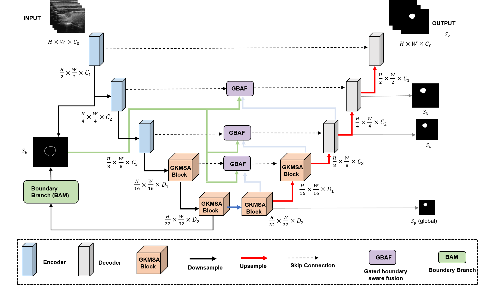

# GBKA-Net

<p align="center">
  
</p>

**GBKA-Net: A gated Kolmogorov–Arnold network with boundary-guided multi-scale attention for thyroid nodule segmentation**

> Under Review — Pattern Analysis and Applications

GBKA-Net extends the U-KAN paradigm with two gating mechanisms for thyroid nodule
segmentation in ultrasound: a **GKMSA** block (global-to-local gated KAN multi-scale
attention) at the bottleneck, and a **GBAF** module (gated boundary-aware fusion) on the
decoder skip pathways, trained with deep supervision and a boundary-weighted loss.

This repository contains everything needed to **reproduce all experiments in the paper
from scratch**, including data preparation, training, evaluation, and figure generation.

---

## Table of contents
1. [Repository structure](#1-repository-structure)
2. [Environment setup](#2-environment-setup)
3. [Datasets](#3-datasets)
4. [Data preparation](#4-data-preparation)
5. [Training](#5-training)
6. [Evaluation](#6-evaluation)
7. [Reproducing each table and figure](#7-reproducing-each-table-and-figure)
8. [Pretrained weights](#8-pretrained-weights)
9. [Configuration reference](#9-configuration-reference)
10. [Citation](#10-citation)

---

## 1. Repository structure

```
GBKA-Net/
├── README.md                 # this file
├── requirements.txt          # exact package versions
├── gbka_net.py               # model definition (GBKANet)
├── losses.py                 # GBKADeepSupervisionLoss (wBCE + wIoU + boundary)
├── datasets.py               # Dataset class + transforms
├── prepare_data.py           # converts raw Kaggle downloads into the expected layout
├── train.py                  # training entry point (one dataset)
├── evaluate.py               # computes Dice, IoU, HD95, Precision, Recall, Accuracy
├── cross_domain.py           # cross-organ generalization (train A, test B)
├── config.py                 # all hyperparameters in one place
├── utils.py                  # metrics, seeding, checkpoint I/O
├── model.png                 # architecture figure
└── data/                     # created by prepare_data.py (not committed)
    ├── TN3K/{train,val,test}/{images,masks}/
    ├── DDTI/{train,val,test}/{images,masks}/
    ├── BUSI/{images,masks}/
    └── UDIAT/{images,masks}/
```

---

## 2. Environment setup

All experiments were run with **Python 3.10** and **PyTorch** on a single
**NVIDIA L4 GPU** (Google Colab). To recreate the environment:

```bash
git clone https://github.com/Hassan48khan/GBKA-Net.git
cd GBKA-Net
python -m venv venv && source venv/bin/activate      # optional
pip install -r requirements.txt
```

`requirements.txt`:

```
torch==2.3.0
torchvision==0.18.0
numpy==1.26.4
opencv-python==4.10.0.84
scipy==1.13.1
scikit-image==0.24.0
medpy==0.5.1          # HD95
albumentations==1.4.10
pandas==2.2.2
matplotlib==3.9.0
tqdm==4.66.4
```

> On Google Colab, `pip install -r requirements.txt` is sufficient; the L4 GPU
> driver and CUDA are preinstalled.

---

## 3. Datasets

All four datasets are publicly available. Download them from the links below
(Kaggle account required), then run `prepare_data.py` (Section 4) to convert
them into the expected layout.

| Dataset | Organ  | Role                         | Link |
|---------|--------|------------------------------|------|
| TN3K    | Thyroid| Train / val / test           | https://www.kaggle.com/datasets/tjahan/tn3k-thyroid-nodule-region-segmentation-dataset/data |
| DDTI    | Thyroid| Train / val / test           | https://www.kaggle.com/datasets/eiraoi/thyroidultrasound/data |
| BUSI    | Breast | Cross-organ generalization   | https://www.kaggle.com/datasets/sabahesaraki/breast-ultrasound-images-dataset |
| UDIAT   | Breast | Cross-organ generalization   | https://www.kaggle.com/datasets/ayush02102001/udiat-segmentation-dataset |

**Splits used in the paper** (set by `prepare_data.py` with `--seed 42`):

| Dataset | Total | Train | Val | Test |
|---------|------:|------:|----:|-----:|
| DDTI    | 637   | 446   | 96  | 95   |
| TN3K    | 3493  | 2303  | 576 | 614  |
| BUSI    | 780   | —     | —   | 780  (test-only) |
| UDIAT   | 163   | —     | —   | 163  (test-only) |

---

## 4. Data preparation

Download and unzip each dataset, then point `prepare_data.py` at the unzipped
folders. The script resizes every image/mask to **256×256**, converts images to
single-channel grayscale, binarizes masks to `{0,1}`, and writes the
train/val/test split used in the paper.

```bash
# Example: prepare all four datasets
python prepare_data.py --dataset tn3k  --raw_dir /path/to/tn3k_unzipped  --out_dir data/TN3K  --seed 42
python prepare_data.py --dataset ddti  --raw_dir /path/to/ddti_unzipped  --out_dir data/DDTI  --seed 42
python prepare_data.py --dataset busi  --raw_dir /path/to/busi_unzipped  --out_dir data/BUSI  --seed 42
python prepare_data.py --dataset udiat --raw_dir /path/to/udiat_unzipped --out_dir data/UDIAT --seed 42
```

After this step, `data/TN3K/train/images/*.png` and the matching
`data/TN3K/train/masks/*.png` will exist (same filename in both folders).

---

## 5. Training

Train GBKA-Net on a single dataset. All hyperparameters match the paper
(Adam, lr `1e-4`, weight decay `1e-5`, cosine annealing, batch size 32, up to
300 epochs, early stopping patience 20).

```bash
# Train on TN3K
python train.py --dataset TN3K --data_root data/TN3K --out_dir runs/tn3k --seed 42

# Train on DDTI
python train.py --dataset DDTI --data_root data/DDTI --out_dir runs/ddti --seed 42
```

This saves the best checkpoint (by validation Dice) to
`runs/<name>/best.pth` and a full training log to `runs/<name>/log.csv`.

---

## 6. Evaluation

Evaluate a trained checkpoint on the corresponding test set. Reports Dice,
IoU, HD95, Precision, Recall, and Accuracy (the six metrics in Tables 3–4).

```bash
python evaluate.py --dataset TN3K --data_root data/TN3K --ckpt runs/tn3k/best.pth
python evaluate.py --dataset DDTI --data_root data/DDTI --ckpt runs/ddti/best.pth
```

Expected results (paper, mean over the test set):

| Dataset | Dice (%) | IoU (%) | HD95 (mm) |
|---------|---------:|--------:|----------:|
| TN3K    | 92.14    | 85.47   | 9.5       |
| DDTI    | 94.87    | 88.26   | 10.2      |

---

## 7. Reproducing each table and figure

| Paper item | Command |
|------------|---------|
| Table 3 (TN3K comparison) | `python evaluate.py --dataset TN3K --ckpt runs/tn3k/best.pth` |
| Table 4 (DDTI comparison) | `python evaluate.py --dataset DDTI --ckpt runs/ddti/best.pth` |
| Ablation (Table 5)        | re-run `train.py`/`evaluate.py` with the flags `--no_gkmsa_gate`, `--no_gbaf_gate`, `--no_deepsup` (see `config.py`) |
| KAN vs MLP (Table 6)      | add `--no_kan` to `train.py` |
| Cross-organ (Sec. 4.4)    | `python cross_domain.py --train TN3K --test BUSI --ckpt runs/tn3k/best.pth` and `--test UDIAT` |
| Reversed shift            | `python cross_domain.py --train BUSI --test TN3K` (train on BUSI first) |
| Efficiency (Table 7)      | `python evaluate.py --dataset TN3K --ckpt runs/tn3k/best.pth --measure_efficiency` |

---

## 8. Pretrained weights

Trained checkpoints for TN3K and DDTI are released under
[GitHub Releases](https://github.com/Hassan48khan/GBKA-Net/releases).
Download `gbka_tn3k.pth` / `gbka_ddti.pth` and pass them to `evaluate.py` via
`--ckpt`.

---

## 9. Configuration reference

| Hyperparameter      | Value            |
|---------------------|------------------|
| Input size          | 256 × 256        |
| Input channels      | 1 (grayscale)    |
| Optimizer           | Adam             |
| Learning rate       | 1e-4             |
| Weight decay        | 1e-5             |
| LR schedule         | Cosine annealing |
| Batch size          | 32               |
| Max epochs          | 300              |
| Early-stop patience | 20               |
| `embed_dims`        | [256, 320, 512]  |
| `depths`            | [1, 1, 1]        |
| `factor` (groups)   | 16               |
| Loss                | wBCE + wIoU (seg heads) + wBCE (boundary), γ=5, λ_b=1 |
| Random seed         | 42               |

All of the above are defined in `config.py` and can be overridden from the
command line.

---

## 10. Citation

If you use this code, please cite:

```bibtex
@article{khan2025gbkanet,
  title   = {GBKA-Net: A gated Kolmogorov--Arnold network with boundary-guided
             multi-scale attention for thyroid nodule segmentation},
  author  = {Khan, Hassan and others},
  journal = {Pattern Analysis and Applications},
  year    = {2025},
  note    = {Under review}
}
```

This repository builds on U-KAN (Li et al., AAAI 2025) for the KAN backbone and
adopts boundary/reverse-attention ideas from BMANet (Wu et al., 2025). Please
also cite those works where appropriate.
